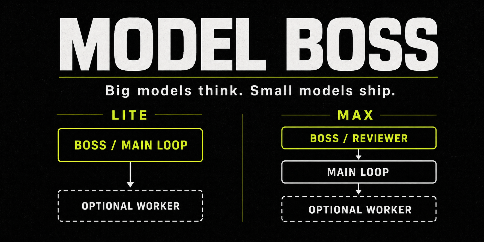

# Model Boss



**English** | [简体中文](README.zh-CN.md)

Big models think. Small models ship.

**Cross-model coding orchestration** for [Claude Code](https://docs.anthropic.com/en/docs/claude-code) and [Codex](https://github.com/openai/codex). The conversation's host-selected or inherited main loop is immutable input: Model Boss never replaces it. The **Boss** is the workflow authority holder—Lite keeps that authority inline in the inherited main loop, while Max uses a distinct, verified authority reviewer. "Big" and "small" are workflow-relative roles, not a universal ranking of providers or models.

Canonical repository: [https://github.com/vincemakes/model-boss](https://github.com/vincemakes/model-boss)

## Should you use it?

Use Model Boss when a task is bounded, constructive, and large enough to repay orchestration overhead: a material multi-file implementation, a migration, repeated mechanical changes, or independent packets with testable acceptance criteria.

Let the main loop work normally for a tiny edit, pure conversation or analysis, unresolved root-cause debugging, or a design/security decision that cannot yet be expressed as acceptance criteria. Rough signals such as 300+ changed lines or 6+ files can help, but task shape matters more than a fixed threshold.

The published measurements are a historical Claude/Fable/Opus snapshot, not a promise for every model profile. See the [scoped benchmark report](BENCHMARKS.md) before choosing Model Boss for cost or quota reasons.

## Lite and Max at a glance

Lite and Max describe where authority lives. They do not name a provider, price tier, or universal model-quality ranking.

| Mode | Authority topology | Worker |
|---|---|---|
| **Lite** | The inherited main loop plans, performs both authority checks, reviews, and integrates. | An optional worker can implement, scout, or perform mechanical work. |
| **Max** | A distinct, verified authority reviewer checks the plan and final evidence while the inherited main loop coordinates and reviews. | The worker is optional; Max can have two levels or three. |

```text
Lite
authority main loop ── plans / reviews / integrates ──> optional worker

Max
authority reviewer <── plan and final evidence ── inherited main loop
                                                   └── optional worker
```

Examples are capability mappings, not hard-coded provider rules:

- Fable or Opus as the main loop with a lower Claude worker is Lite.
- Sol as the main loop with Terra or Luna workers is Lite.
- Terra as the main loop with a Sol reviewer and an optional Luna worker is Max.
- Kimi K3 can be an authority-capable external route only when its exact model identity is pinned, verified live, read-only, and distinct from the main loop.

A separate worker is never required. Lite may run entirely in the main loop; Max always requires its separate reviewer but may let the main loop implement.

## The main loop is already selected

The host-selected conversation model is immutable input. Model Boss never replaces it, and profile, user, project, or per-run configuration must not contain a substitute main loop. If the host cannot establish the main loop's canonical `provider_family:resolved_model_id:variant` fingerprint, resolution stops with `needs_context`.

Route names, wrapper names, endpoints, accounts, and model-family prose are hints, not identity proof. Two different aliases that resolve to the same canonical fingerprint are the same model for authority-separation purposes.

## How the shared state machine works

Lite and Max use the same ordered state machine:

```text
RESOLVE -> PREFLIGHT -> CLASSIFY -> RECON -> DRAFT_PLAN -> AUTHORITY_PLAN_CHECK -> DISPATCH -> GATE -> PATCH_AUDIT -> MAIN_LOOP_REVIEW -> AUTHORITY_FINAL_CHECK -> INTEGRATE
```

Lite binds both authority checkpoints to the main loop inline. Max binds both checkpoints to one distinct eligible reviewer. Max cannot dispatch before plan approval, and neither mode can integrate before gates, a complete patch audit, main-loop review, and final approval.

For a sealed external-worker invocation, the chosen topology is also a runtime
invariant: the required `worker --mode lite|max` value is recorded as
`authority_mode` in the sealed bundle. That `authority_mode` cannot be switched,
downgraded, or reinterpreted during review or integration. A Lite bundle accepts only
inline main-loop authority; a Max bundle accepts only a distinct external reviewer.

Workers receive a bounded task packet instead of conversation history. They work in a disposable worktree, and their claims are checked against independently captured process and Git evidence. Final approval is bound to exactly:

```text
source_snapshot_hash
worker_delta_hash
projected_task_patch_hash
```

If any evidence or destination state changes, the old approval cannot be reused. The full state, evidence, retry, and integration contract is in the [protocol reference](references/protocol.md).

## Model profiles, not model lock-in

Profiles provide capability-based route defaults:

- **authority** routes may review in Max or keep authority inline in Lite.
- **balanced** routes may coordinate or implement.
- **fast** routes may implement, scout, or perform mechanical work.

Those declarations are candidates, not proof. Preflight must verify live reachability, exact effective identity, permissions, credential names, and—when an external command can write—a sandbox bound to that exact invocation.

Built-in profiles cover Claude, OpenAI, and Kimi examples, while project and user configuration can replace route definitions. Resolution follows profile → user → project → per-run precedence and never mutates the inherited main loop. The published examples and schema are [`config/model-boss.example.json`](config/model-boss.example.json) and [`config/model-boss.schema.json`](config/model-boss.schema.json); project discovery uses `.model-boss.json`, while user discovery uses `${XDG_CONFIG_HOME:-$HOME/.config}/model-boss/config.json`. See [routing and capability resolution](references/routing.md) for the complete rules.

The runtime CLI requires Python 3.11+ and Git. The POSIX setup examples also use `bash` and `install`. A write-capable external worker additionally requires a verified OS backend: `/usr/bin/sandbox-exec` on macOS or Bubblewrap (`bwrap`) on Linux, including WSL. Native Windows has no external-writer backend and uses host-native Claude Code or Codex agents instead.

## Claude Code setup

These are fresh-install commands. Each scope installs the skill plus the four host-specific role declarations.

### POSIX — user scope

```bash
mkdir -p "$HOME/.claude/skills"
git clone https://github.com/vincemakes/model-boss.git "$HOME/.claude/skills/model-boss"
mkdir -p "$HOME/.claude/agents"
for role in reviewer implementer mechanic scout; do
  install -m 0644 "$HOME/.claude/skills/model-boss/assets/agents/claude-code/$role.md" \
    "$HOME/.claude/agents/model-boss-$role.md"
done
```

### POSIX — project scope

```bash
mkdir -p .claude/skills
git clone https://github.com/vincemakes/model-boss.git .claude/skills/model-boss
mkdir -p .claude/agents
for role in reviewer implementer mechanic scout; do
  install -m 0644 ".claude/skills/model-boss/assets/agents/claude-code/$role.md" \
    ".claude/agents/model-boss-$role.md"
done
```

### PowerShell — user scope

```powershell
$skill = Join-Path $HOME ".claude\skills\model-boss"
$agents = Join-Path $HOME ".claude\agents"
New-Item -ItemType Directory -Force (Split-Path $skill -Parent) | Out-Null
git clone https://github.com/vincemakes/model-boss.git $skill
New-Item -ItemType Directory -Force $agents | Out-Null
foreach ($role in "reviewer", "implementer", "mechanic", "scout") {
  Copy-Item (Join-Path $skill "assets\agents\claude-code\$role.md") `
    (Join-Path $agents "model-boss-$role.md")
}
```

### PowerShell — project scope

```powershell
$skill = ".claude\skills\model-boss"
$agents = ".claude\agents"
New-Item -ItemType Directory -Force (Split-Path $skill -Parent) | Out-Null
git clone https://github.com/vincemakes/model-boss.git $skill
New-Item -ItemType Directory -Force $agents | Out-Null
foreach ($role in "reviewer", "implementer", "mechanic", "scout") {
  Copy-Item (Join-Path $skill "assets\agents\claude-code\$role.md") `
    (Join-Path $agents "model-boss-$role.md")
}
```

## Codex setup

Check the installed CLI first:

```bash
codex --version
```

`codex --version` is diagnostic, not a capability proof. Before selecting the bundled profile, Model Boss preflight must confirm that the installed Codex supports custom agents, that the exact Sol/Terra/Luna IDs are available in the current account and model catalog, and that the requested sandbox and reasoning settings are accepted. A failed availability check returns `provider_unavailable` or `reviewer_unavailable`. Setup never upgrades the CLI automatically.

The bundled Sol profile treats Sol as an authority route, Terra as a balanced route, and Luna as a fast route. These are fresh-install commands for the skill and four Codex agent declarations.

### POSIX — project scope

```bash
mkdir -p .agents/skills
git clone https://github.com/vincemakes/model-boss.git .agents/skills/model-boss
mkdir -p .codex/agents
for role in reviewer implementer mechanic scout; do
  install -m 0644 ".agents/skills/model-boss/assets/agents/codex/$role.toml" \
    ".codex/agents/model-boss-$role.toml"
done
```

### POSIX — user scope

```bash
mkdir -p "$HOME/.agents/skills"
git clone https://github.com/vincemakes/model-boss.git "$HOME/.agents/skills/model-boss"
mkdir -p "$HOME/.codex/agents"
for role in reviewer implementer mechanic scout; do
  install -m 0644 "$HOME/.agents/skills/model-boss/assets/agents/codex/$role.toml" \
    "$HOME/.codex/agents/model-boss-$role.toml"
done
```

### PowerShell — project scope

```powershell
$skill = ".agents\skills\model-boss"
$agents = ".codex\agents"
New-Item -ItemType Directory -Force (Split-Path $skill -Parent) | Out-Null
git clone https://github.com/vincemakes/model-boss.git $skill
New-Item -ItemType Directory -Force $agents | Out-Null
foreach ($role in "reviewer", "implementer", "mechanic", "scout") {
  Copy-Item (Join-Path $skill "assets\agents\codex\$role.toml") `
    (Join-Path $agents "model-boss-$role.toml")
}
```

### PowerShell — user scope

```powershell
$skill = Join-Path $HOME ".agents\skills\model-boss"
$agents = Join-Path $HOME ".codex\agents"
New-Item -ItemType Directory -Force (Split-Path $skill -Parent) | Out-Null
git clone https://github.com/vincemakes/model-boss.git $skill
New-Item -ItemType Directory -Force $agents | Out-Null
foreach ($role in "reviewer", "implementer", "mechanic", "scout") {
  Copy-Item (Join-Path $skill "assets\agents\codex\$role.toml") `
    (Join-Path $agents "model-boss-$role.toml")
}
```

## Kimi and GLM external routes

From the installed checkout, install the compatibility wrappers into an explicit directory:

```bash
bash scripts/setup-model-providers.sh --install-path "$HOME/.local/bin"
```

The setup command never edits shell startup files; add that directory to `PATH` yourself if necessary. Its exact role mapping is:

If the credentials file does not exist, an explicit `--install-path` still installs the wrappers only; it does not create a credentials file or invent secret values. Supply the required environment variables at launch or configure `${XDG_CONFIG_HOME:-$HOME/.config}/model-boss/credentials.json` (overridable with `MODEL_BOSS_CREDENTIALS`) before using a provider route.

| Route role | Reviewer transport base command | Write command allowed only inside verified OS sandbox |
|---|---|---|
| Kimi reviewer candidate | `claude-kimi` | — |
| Kimi implementer | — | `claude-kimi-bypass -p` |
| GLM reviewer candidate | `claude-glm` | — |
| GLM implementer | — | `claude-glm-bypass -p` |
| GLM fast scout/mechanic | `claude-glm-turbo` | `claude-glm-turbo-bypass -p` |

The main loop can then run an external implementation as one sealed operation:

```bash
mkdir -p "$PWD/../model-boss-runs"
python3 scripts/model-boss.py worker \
  --repo "$PWD" \
  --temp-parent "$PWD/../model-boss-runs" \
  --route claude-kimi-bypass \
  --task /absolute/path/to/task.json \
  --mode lite
```

The command creates and materializes the disposable worktree, reconstructs the
manifest, injects bypass permission only after a fresh sandbox probe, runs the worker
and gates, and seals the delta. It does not integrate. Use `--mode lite` when the
already-selected main loop owns reasoning and final review and the secondary worker
implements. Use `--mode max` when that main loop may be a lower tier and a distinct,
higher-authority external reviewer owns the authority decision; Max may still send
implementation to an even lower worker. The selected mode is immutable for that
manifest, so changing topology means starting a new worker invocation.

After the main loop has reviewed the complete evidence and written a strict review
context JSON, seal the matching review. Lite uses the inherited main loop inline:

```bash
python3 scripts/model-boss.py review --inline \
  --main-fingerprint <provider:model:variant> \
  --manifest <manifest> \
  --context /absolute/path/to/review-context.json
```

Max uses an external reviewer configured by profile and route; `--inline` is invalid:

```bash
python3 scripts/model-boss.py review --profile /absolute/path/to/profile.json \
  --route <reviewer-route> \
  --main-fingerprint <provider:model:variant> \
  --manifest <manifest> \
  --context /absolute/path/to/review-context.json
```

An approving review writes an invocation-bound, three-hash final-review receipt.
Integration reads that sealed receipt through the manifest; it no longer accepts a
caller-supplied approval file:

```bash
python3 scripts/model-boss.py integrate <manifest>
```

See the [external CLI contract](references/adapters/external-cli.md) for the exact task
and review-context schemas. Do not run a bypass alias directly from an ordinary
repository; without the one-shot invocation manifest it fails closed. These same
manifest and command contracts can be driven by either a Claude Code or Codex main
loop; model/provider names are route data, not branches in the workflow.

Plain wrappers are not inherently read-only. Reviewer transport appends `--safe-mode --no-session-persistence --permission-mode plan --tools "" -p`, runs from an isolated evidence directory, disables repository and tool access, and verifies that directory did not mutate. Even then, a candidate is ineligible for Max until preflight proves its exact model fingerprint and separation from the main loop.

A command name is not proof of model identity and never establishes independence. Codex can invoke an existing `claude-kimi*` command as an external route; this does not make Kimi appear natively in the Codex model picker. Wrapper installation never makes Kimi or GLM a native picker entry.

Write-capable bypass routes launch only inside a verified OS sandbox bound to the command, disposable worktree, route state, and sandbox profile. The current verified writer backends are macOS and Linux, including Linux under WSL. Native Windows external writers fail closed with `sandbox_unavailable`; Claude Code and Codex native-agent orchestration remains available there.

The external worker model receives exactly the `Read`, `Glob`, `Grep`, `Edit`, and
`Write` tools. Bash is disabled; Web and MCP tools are unavailable. Declared gate
commands are direct argument arrays executed by the Model Boss host after the model
call, not shell access granted to the model.

## Safety and failure behavior

Model Boss fails closed:

- An explicit Max request never silently degrades to Lite. An unavailable, colliding, unverified, or effectively write-capable reviewer blocks dispatch.
- External writers never run in the user's repository. They receive only named credentials in a minimal child environment and can write only inside an invocation-owned disposable worktree.
- Prompts, logs, manifests, and review packets omit credential values, but the provider
  client process still receives the credentials needed to call its endpoint. Prefer a
  short-lived, narrowly scoped token with the least permissions the route supports.
  The tool allowlist and filesystem sandbox are not a network security boundary: a
  malicious or compromised provider binary can misuse credentials or readable data,
  and Model Boss cannot prevent that binary from sending them over its permitted
  provider connection. Install and run only provider binaries you trust.
- A worker may self-fix failed gates at most three times. Final authority review allows two revision rounds; a third `revise` returns `review_revise` without integration.
- Out-of-scope writes return `scope_violation`. Changed evidence returns `approval_stale`. Destination drift returns `destination_changed` and requires a fresh snapshot, audit, main-loop review, and authority approval.
- Failures report concise non-secret evidence and preserve user changes. Cleanup removes only invocation-owned resources.

The complete public status set is:

```text
ok
needs_context
gate_failed
provider_unavailable
reviewer_unavailable
timeout
scope_violation
transport_error
review_revise
approval_stale
destination_changed
sandbox_unavailable
```

## Reference benchmark snapshot

The [full benchmark report](BENCHMARKS.md) is a historical reference for the 2026 Claude/Fable/Opus stack. It does not predict savings for Sol, Kimi, or future profiles.

In that recorded large constructive run, Lite changed strongest-model output tokens by `-42%` and used a `-34%` price-weighted quota proxy; Max changed strongest-model output tokens by `-89%` and used a `-88%` quota proxy. Those are different measurements and should not be interchanged. The blind bug-hunt is one observed probe, not general proof, and the report preserves its single-run caveat, raw figures, methodology, and negative results.

## When Model Boss steps aside

Model Boss steps aside before dispatch for tiny edits, pure conversation, unresolved debugging, judgment-dense work without testable acceptance criteria, or tasks below the delegation floor. It also stops rather than improvising when identity, reviewer, provider, sandbox, gate, scope, approval, or destination invariants fail.

Stepping aside leaves the inherited main loop in charge. It does not switch models, invent a route, weaken Max, or treat orchestration already spent as a reason to continue unsafely.

## Migrating from Token Saver

Migration is an explicit, no-overwrite copy to the Model Boss surfaces below. Normal discovery ignores all former paths and variables. Only `scripts/setup-model-providers.sh` may explicitly read the legacy `$HOME/.claude/fable-token-saver/providers.env`, and it parses that file as data—never as shell code. Migration never deletes or edits legacy data.

| Former surface | Model Boss surface |
|---|---|
| `https://github.com/vincemakes/token-saver` | `https://github.com/vincemakes/model-boss` |
| `.claude/skills/token-saver`, `.agents/skills/token-saver` | `.claude/skills/model-boss`, `.agents/skills/model-boss` |
| `scripts/token-saver-route.py` | `scripts/model-boss.py` |
| `runtime.token_saver` | `runtime.model_boss` |
| `.token-saver.json` | `.model-boss.json` |
| `${XDG_CONFIG_HOME:-$HOME/.config}/token-saver/config.json` | `${XDG_CONFIG_HOME:-$HOME/.config}/model-boss/config.json` |
| `$HOME/.claude/fable-token-saver/providers.env`, `${XDG_CONFIG_HOME:-$HOME/.config}/token-saver/credentials.json` | `${XDG_CONFIG_HOME:-$HOME/.config}/model-boss/credentials.json` |
| `TOKEN_SAVER_*` | `MODEL_BOSS_*` |
| `token-saver-<role>.md`, `token-saver-<role>.toml` | `model-boss-<role>.md`, `model-boss-<role>.toml` |
| `token-saver-runs` | `model-boss-runs` |
| `config/token-saver.example.json`, `config/token-saver.schema.json` | `config/model-boss.example.json`, `config/model-boss.schema.json` |
| `dist/token-saver.skill` | `dist/model-boss.skill` |

## License

[MIT](LICENSE)
