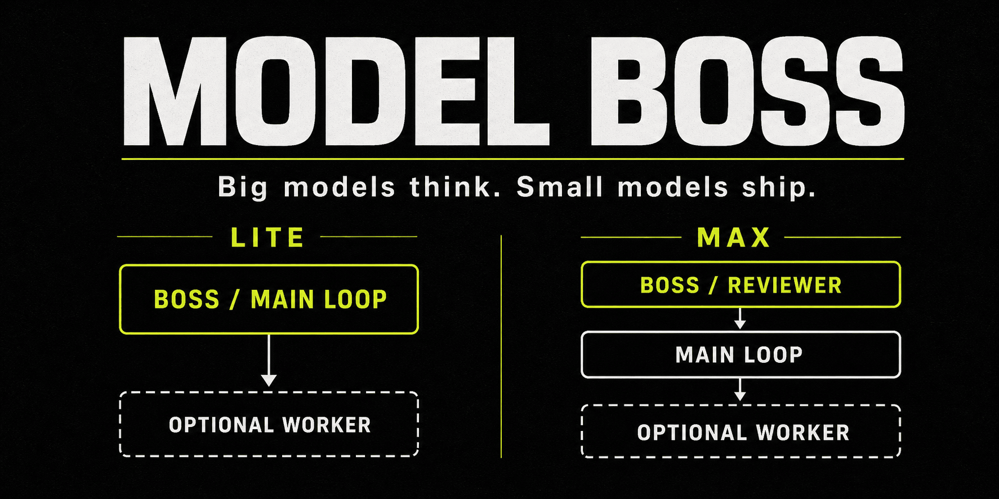

# Model Boss



**English** | [简体中文](README.zh-CN.md)

[](https://github.com/vincemakes/model-boss/actions/workflows/tests.yml)

Big models think. Small models ship.

**Cross-model coding orchestration** for [Claude Code](https://docs.anthropic.com/en/docs/claude-code) and [Codex](https://github.com/openai/codex). The conversation's host-selected or inherited main loop is immutable input: Model Boss never replaces it. The **Boss** is the workflow authority holder—Lite keeps that authority inline in the inherited main loop, while Max uses a distinct, verified authority reviewer. "Big" and "small" are workflow-relative roles, not a universal ranking of providers or models.

Canonical repository: [https://github.com/vincemakes/model-boss](https://github.com/vincemakes/model-boss)

**Two skills, one repo.** Install once, then say what you want — the skill decides from context.

| Skill | Say this | What it does |
|---|---|---|
| `boss-dispatch` | `让 opus 去写，你来审` · `走 model boss max` · `省token` · `分层干活` | Plans, dispatches a worker, gates the work, and audits the evidence while the inherited main loop keeps authority. This is the Model Boss orchestration skill, previously named `model-boss`. |
| `boss-call` | `看看三个终端做得怎样` · `给 reelfo 发指令` | A single-line mailbox between one Boss and several member sessions; members report at the start of each turn. |

The dispatch skill moved from the repository root into `boss-dispatch/` and its skill name changed `model-boss` → `boss-dispatch`; trigger phrases are unchanged, so re-run `bash boss-dispatch/install.sh` after updating.

### Install and activate boss-call

`boss-call` is a CLI plus skills; it is installed separately from `boss-dispatch` and has no npm package or harness extension:

```bash
git clone https://github.com/vincemakes/model-boss.git "$HOME/.local/share/model-boss"
node "$HOME/.local/share/model-boss/boss-call/bin/boss-call.mjs" setup
boss-call help
```

`setup` links the skill into the supported harness skill directories and, when needed, links the CLI at `~/.local/bin/boss-call`. It never edits shell startup files, so add `~/.local/bin` to `PATH` yourself if necessary.

Create a room in the Boss's working directory, then register each member from its own repository:

```bash
boss-call host migration --root "$PWD"

cd ~/work/reelfo
boss-call join migration --as reelfo
```

Installation and `join` do **not** turn every session in that directory into a member. Start kiso, Claude Code, Codex, pi, or opencode normally; it remains an ordinary session until you say **“follow the boss-call skill”**. In Claude Code, `/boss-call` is the equivalent shortcut. A newly opened session needs that instruction once. No extension is installed, and `boss-call` never writes `AGENTS.md`, `CLAUDE.md`, or any other file in the registered repository.

After activation, routine work can continue without a person relaying every message: the session reads mail, works, reports, and blocks in `boss-call wait` for the next instruction. Human authorization is still required for spending money, pushing, merging, deploying, and production configuration; an underspecified product choice is sent back as an `ask`. The generic interactive path stays alive only while the session is blocked in `wait`; optional fully headless resume is currently kiso-only through `boss-call serve`.

The mailbox at `~/.boss-call/<room>/messages.jsonl` stores only messages deliberately posted through `boss-call` (`seq`, `ts`, `from`, `to`, `kind`, `text`, and optional `ref`). It is not a copy of the Claude, Codex, or other harness conversation. `peek-session` can separately summarize kiso's own `~/.kiso/sessions/*.jsonl` event log; boss-call does not collect equivalent transcripts from the other harnesses. See [the boss-call guide](https://github.com/vincemakes/model-boss/blob/main/boss-call/README.md) for the complete setup, automation boundary, and on-disk format.

## Usage

After install (see the Claude Code and Codex setup sections below) there is no command to run — you invoke Model Boss conversationally. Phrases like `model boss`, `save model tokens`, or `分层干活` trigger the skill; then describe the topology you want:

```text
use model boss: let sonnet implement the retry logic in src/http, you review   → Lite
走 model boss,让 opus 去开发,你来审核                                           → Lite, `opus` = the newest Opus
use model boss: let opus 4.6 implement, you review                             → Lite, worker pinned to Opus 4.6
model boss max — have fable review the plan and the final diff                → Max
走 model boss max,让 fable 审计划和最终 diff                                     → Max
```

A spoken model name selects the matching route exactly; a version the catalog does not list (`fable 6`) stops with `needs_context` rather than a nearby guess.

In Lite the inherited main loop keeps both authority checkpoints and dispatches an optional worker. In Max a distinct, verified reviewer approves the plan before dispatch and the final evidence before integration — and an explicit Max request stops with `reviewer_unavailable` rather than silently degrading.

Before any work starts, Model Boss prints the resolved topology verdict (`Main loop / Resolved mode / Authority / Worker / Resolution source`), each line as `route/model@effort`. Read it: worker and reviewer names are route aliases, and the verdict shows the exact model each alias actually resolved to on your host and the effort it will run at — for example a bare `opus` resolves to the newest Opus your host exposes, which on a not-yet-updated host can lag the newest public release. A route name is never identity proof. Under the verdict it prints the `estimate` table that priced inline against Lite and Max for this task.

Tiny edits, pure discussion, and unresolved root-cause debugging do not justify orchestration: Model Boss steps aside and the main loop works normally.

## Should you use it?

Use Model Boss when a task is bounded, constructive, and large enough to repay orchestration overhead: a material multi-file implementation, a migration, repeated mechanical changes, or independent packets with testable acceptance criteria.

Let the main loop work normally for a tiny edit, pure conversation or analysis, unresolved root-cause debugging, or a design/security decision that cannot yet be expressed as acceptance criteria.

For a Claude Max subscription the weekly quota is one shared total with a cap on Fable's share, so Model Boss's default policy is quality within pace, not lowest cost. Execution-heavy, specifiable work such as large refactors, greenfield subsystems, and multi-feature sprints runs as Lite: a Fable main loop plans, reviews, and integrates while Opus 5 workers at `xhigh` implement, independent packets in parallel. That topology's Fable share of spend measured 48%, so it depletes both halves of the week together. Four cases stay out of it:

| Case | Why | Do instead |
|---|---|---|
| Judgment-dense work (root-cause debugging, design, security) | The reasoning is the workload; a hand-off adds latency and reading cost for the same result | Fable inline, effort `high` |
| Small single-packet changes, under roughly 200 lines | Packet plus review costs more Fable than the change; the hand-off is serial | Fable inline |
| One interactive stream where latency matters | A single worker is a serial hop (2.7x wall time measured); parallelism needs two or more packets | Split into packets or stay inline |
| Fable half running ahead of pace | Lite spends about as much Fable as inline; it fills the other half but does not stretch this one | A Max session: Opus 5 main loop, Fable as reviewer, about $0.4 Fable per task |

The `estimate` command encodes exactly this. Give it the task shape (`--lines`, `--files`, `--judgment`, `--packets`) and the three percentages from `/usage` (`--total-used`, `--fable-used`, `--week-elapsed`) and it prints the regime, the cost table, and the recommendation, including a `switch-main-loop` verdict when the Fable half is exhausted. Steer the week by one number: Fable's share of total spend, target 50%; judgment work inline pushes it up, Max or Opus sessions pull it down.

The published measurements are a historical Claude/Fable/Opus snapshot, not a promise for every model profile. See the [scoped benchmark report](BENCHMARKS.md) before relying on any of the numbers. The 2026-09 Fable 5.1 rerun linked from [BENCHMARKS.md](BENCHMARKS.md) measured the same large task at low and medium effort: Fable 5.1 inline at low effort was the cheapest and fastest Fable path, a Fable main loop with an Opus 5 worker spent Fable at about the inline rate while filling the other half of the quota, and a Sonnet 5 worker cut Fable spend by roughly a third. Delegation is how you use the whole week; Max is how you stretch Fable; lower effort is how you make Fable cheap.

## Lite and Max at a glance

Lite and Max describe where authority lives. They do not name a provider, price tier, or universal model-quality ranking.

| Mode | Authority topology | Worker |
|---|---|---|
| **Lite** | The inherited main loop plans, performs both authority checks, reviews, and integrates. | An optional worker can implement, scout, or perform mechanical work. |
| **Max** | A distinct, verified authority reviewer checks the plan and final evidence while the inherited main loop coordinates and reviews. | The worker is optional; Max can have two levels or three. |

```text
Lite
authority main loop ── plans / reviews / integrates ──> optional worker

Max
authority reviewer <── plan and final evidence ── inherited main loop
                                                   └── optional worker
```

Examples are capability mappings, not hard-coded provider rules:

- Fable or Opus as the main loop with a lower Claude worker is Lite.
- Sol as the main loop with Terra or Luna workers is Lite.
- Terra as the main loop with a Sol reviewer and an optional Luna worker is Max.
- Kimi K3 can be an authority-capable external route only when its exact model identity is pinned, verified live, read-only, and distinct from the main loop.

A separate worker is never required. Lite may run entirely in the main loop; Max always requires its separate reviewer but may let the main loop implement.

## The main loop is already selected

The host-selected conversation model is immutable input. Model Boss never replaces it, and profile, user, project, or per-run configuration must not contain a substitute main loop. If the host cannot establish the main loop's canonical `provider_family:resolved_model_id:variant` fingerprint, resolution stops with `needs_context`.

Route names, wrapper names, endpoints, accounts, and model-family prose are hints, not identity proof. Two different aliases that resolve to the same canonical fingerprint are the same model for authority-separation purposes.

## How the shared state machine works

Lite and Max use the same ordered state machine:

```text
RESOLVE -> PREFLIGHT -> CLASSIFY -> RECON -> DRAFT_PLAN -> AUTHORITY_PLAN_CHECK -> DISPATCH -> GATE -> PATCH_AUDIT -> MAIN_LOOP_REVIEW -> AUTHORITY_FINAL_CHECK -> INTEGRATE
```

Lite binds both authority checkpoints to the main loop inline. Max binds both checkpoints to one distinct eligible reviewer. Max cannot dispatch before plan approval, and neither mode can integrate before gates, a complete patch audit, main-loop review, and final approval.

For a sealed external-worker invocation, the chosen topology is also a runtime
invariant: the required `worker --mode lite|max` value is recorded as
`authority_mode` in the sealed bundle. That `authority_mode` cannot be switched,
downgraded, or reinterpreted during review or integration. A Lite bundle accepts only
inline main-loop authority; a Max bundle accepts only a distinct external reviewer.

Workers receive a bounded task packet instead of conversation history. They work in a disposable worktree, and their claims are checked against independently captured process and Git evidence. Final approval is bound to exactly:

```text
source_snapshot_hash
worker_delta_hash
projected_task_patch_hash
```

If any evidence or destination state changes, the old approval cannot be reused. The full state, evidence, retry, and integration contract is in the [protocol reference](boss-dispatch/references/protocol.md).

## Model profiles, not model lock-in

Profiles provide capability-based route defaults:

- **authority** routes may review in Max or keep authority inline in Lite.
- **balanced** routes may coordinate or implement.
- **fast** routes may implement, scout, or perform mechanical work.

Those declarations are candidates, not proof. Preflight must verify live reachability, exact effective identity, permissions, credential names, and—when an external command can write—a sandbox bound to that exact invocation.

The default Anthropic profile pins every model the Claude Code picker exposes today (catalog snapshot 2026-09-02), one read-only reviewer route and one write-capable worker route per authority model:

| Route(s) | Exact model | Effort levels | Cache read $/MTok | Min cacheable prefix |
|---|---|---|---|---|
| `fable-5.1`, `fable-5.1-worker` | `claude-fable-5-1` | low…max | 0.25 | 512 |
| `fable-5`, `fable-5-worker` | `claude-fable-5` | low…max | 1.00 | 512 |
| `opus-5`, `opus-5-worker` | `claude-opus-5` | low…max | 0.50 | 512 |
| `opus-4.8`, `opus-4.8-worker` | `claude-opus-4-8` | low…max | 0.50 | 1024 |
| `opus-4.7`, `opus-4.7-worker` | `claude-opus-4-7` | low…max | 0.50 | 2048 |
| `opus-4.6`, `opus-4.6-worker` | `claude-opus-4-6` | low, medium, high, max | 0.50 | 4096 |
| `sonnet-5` | `claude-sonnet-5` | low…max | 0.20 | 1024 |
| `sonnet-4.6` | `claude-sonnet-4-6` | low, medium, high, max | 0.30 | 1024 |
| `haiku-4.5` | `claude-haiku-4-5` | none | 0.10 | 4096 |

Defaults: reviewers `fable-5.1` then `opus-5` at `high`; workers `opus-5-worker` then `sonnet-5` at `xhigh`; scouts and mechanics `haiku-4.5`. Every route carries an `effort` (validated against the catalog, so `xhigh` on Opus 4.6 is a configuration error), a `quota_weight` (default `1.0`; raise it for the window you find scarcest) and optional spoken `aliases`. Effort is a spend control, not identity: the same model at two effort levels still collides for authority separation. Two helper commands back this up, neither of which touches a model:

```bash
python3 <model-boss-skill-root>/scripts/model-boss.py match-models --profile anthropic --text "让 opus 4.6 去开发"
python3 <model-boss-skill-root>/scripts/model-boss.py estimate --profile anthropic --main-model claude-fable-5-1 --main-effort medium --worker opus-5-worker --lines 800 --files 8 --judgment low --packets 2 --total-used 40 --fable-used 45 --week-elapsed 40
```

`match-models` maps the model names in a request to routes with longest-match-wins and reports an unknown version (`fable 6`) as `needs_context` instead of guessing. `estimate` prices inline, Lite, and Max for the task shape, charging the worker's cold start (caches are model-scoped and subagents never read the main loop's cache), delegated volume, and expected rework, then applies the `pace` policy described above, or the cost objectives `weighted` and `main-model` on request; its coefficients are calibrated on the recorded runs and are a proxy, not a bill.

Built-in profiles cover Claude, OpenAI, and Kimi examples, while project and user configuration can replace route definitions. Resolution follows profile → user → project → per-run precedence and never mutates the inherited main loop. The published examples and schema are [`config/model-boss.example.json`](boss-dispatch/config/model-boss.example.json) and [`config/model-boss.schema.json`](boss-dispatch/config/model-boss.schema.json); project discovery uses `.model-boss.json`. On POSIX, user discovery uses `$XDG_CONFIG_HOME/model-boss/config.json` only when `XDG_CONFIG_HOME` is absolute; otherwise it uses `$HOME/.config/model-boss/config.json`. On PowerShell, an absolute `$env:XDG_CONFIG_HOME` wins; otherwise the runtime reads absolute `$env:HOME` and falls back to absolute `$env:USERPROFILE` only when HOME is absent. The displayed fallback `$HOME\.config\model-boss\config.json` uses PowerShell's `$HOME` convenience variable. Missing or relative selected roots fail closed. See [routing and capability resolution](boss-dispatch/references/routing.md) for the complete rules.

The runtime CLI requires Python 3.11+ and Git. The POSIX setup examples also use `bash` and `install`. A write-capable external worker additionally requires a verified OS backend: `/usr/bin/sandbox-exec` on macOS or Bubblewrap (`bwrap`) on Linux, including WSL. Native Windows has no external-writer backend and uses host-native Claude Code or Codex agents instead.

## Claude Code setup

These are fresh-install commands. Each scope installs the skill plus the four host-specific role declarations.

### POSIX — user scope

```bash
git clone https://github.com/vincemakes/model-boss.git "$HOME/.local/share/model-boss"
bash "$HOME/.local/share/model-boss/boss-dispatch/install.sh"
mkdir -p "$HOME/.claude/agents"
for role in reviewer implementer mechanic scout; do
  install -m 0644 "$HOME/.claude/skills/boss-dispatch/assets/agents/claude-code/$role.md" \
    "$HOME/.claude/agents/model-boss-$role.md"
done
```

### POSIX — project scope

```bash
git clone https://github.com/vincemakes/model-boss.git .model-boss
mkdir -p .claude/skills
ln -sfn "$PWD/.model-boss/boss-dispatch" .claude/skills/boss-dispatch
mkdir -p .claude/agents
for role in reviewer implementer mechanic scout; do
  install -m 0644 ".claude/skills/boss-dispatch/assets/agents/claude-code/$role.md" \
    ".claude/agents/model-boss-$role.md"
done
```

### PowerShell — user scope

```powershell
$repo = Join-Path $HOME ".local\share\model-boss"
$skill = Join-Path $HOME ".claude\skills\boss-dispatch"
$agents = Join-Path $HOME ".claude\agents"
New-Item -ItemType Directory -Force (Split-Path $repo -Parent) | Out-Null
git clone https://github.com/vincemakes/model-boss.git $repo
New-Item -ItemType Directory -Force (Split-Path $skill -Parent) | Out-Null
if (Test-Path $skill) { Remove-Item -Recurse -Force $skill }
New-Item -ItemType SymbolicLink -Path $skill -Target (Join-Path $repo "boss-dispatch") | Out-Null
New-Item -ItemType Directory -Force $agents | Out-Null
foreach ($role in "reviewer", "implementer", "mechanic", "scout") {
  Copy-Item (Join-Path $skill "assets\agents\claude-code\$role.md") `
    (Join-Path $agents "model-boss-$role.md")
}
```

### PowerShell — project scope

```powershell
$repo = ".model-boss"
$skill = ".claude\skills\boss-dispatch"
$agents = ".claude\agents"
New-Item -ItemType Directory -Force (Split-Path $skill -Parent) | Out-Null
git clone https://github.com/vincemakes/model-boss.git $repo
if (Test-Path $skill) { Remove-Item -Recurse -Force $skill }
New-Item -ItemType SymbolicLink -Path $skill -Target (Join-Path $repo "boss-dispatch") | Out-Null
New-Item -ItemType Directory -Force $agents | Out-Null
foreach ($role in "reviewer", "implementer", "mechanic", "scout") {
  Copy-Item (Join-Path $skill "assets\agents\claude-code\$role.md") `
    (Join-Path $agents "model-boss-$role.md")
}
```

## Codex setup

Check the installed CLI first:

```bash
codex --version
```

`codex --version` is diagnostic, not a capability proof. Before selecting the bundled profile, Model Boss preflight must confirm that the installed Codex supports custom agents, that the exact Sol/Terra/Luna IDs are available in the current account and model catalog, and that the requested sandbox and reasoning settings are accepted. A failed availability check returns `provider_unavailable` or `reviewer_unavailable`. Setup never upgrades the CLI automatically.

The bundled Sol profile treats Sol as an authority route, Terra as a balanced route, and Luna as a fast route. These are fresh-install commands for the skill and four Codex agent declarations.

### POSIX — project scope

```bash
git clone https://github.com/vincemakes/model-boss.git .model-boss
mkdir -p .codex/skills
ln -sfn "$PWD/.model-boss/boss-dispatch" .codex/skills/boss-dispatch
mkdir -p .codex/agents
for role in reviewer implementer mechanic scout; do
  install -m 0644 ".codex/skills/boss-dispatch/assets/agents/codex/$role.toml" \
    ".codex/agents/model-boss-$role.toml"
done
```

### POSIX — user scope

```bash
git clone https://github.com/vincemakes/model-boss.git "$HOME/.local/share/model-boss"
bash "$HOME/.local/share/model-boss/boss-dispatch/install.sh"
mkdir -p "$HOME/.codex/agents"
for role in reviewer implementer mechanic scout; do
  install -m 0644 "$HOME/.codex/skills/boss-dispatch/assets/agents/codex/$role.toml" \
    "$HOME/.codex/agents/model-boss-$role.toml"
done
```

### PowerShell — project scope

```powershell
$repo = ".model-boss"
$skill = ".codex\skills\boss-dispatch"
$agents = ".codex\agents"
New-Item -ItemType Directory -Force (Split-Path $skill -Parent) | Out-Null
git clone https://github.com/vincemakes/model-boss.git $repo
if (Test-Path $skill) { Remove-Item -Recurse -Force $skill }
New-Item -ItemType SymbolicLink -Path $skill -Target (Join-Path $repo "boss-dispatch") | Out-Null
New-Item -ItemType Directory -Force $agents | Out-Null
foreach ($role in "reviewer", "implementer", "mechanic", "scout") {
  Copy-Item (Join-Path $skill "assets\agents\codex\$role.toml") `
    (Join-Path $agents "model-boss-$role.toml")
}
```

### PowerShell — user scope

```powershell
$repo = Join-Path $HOME ".local\share\model-boss"
$skill = Join-Path $HOME ".codex\skills\boss-dispatch"
$agents = Join-Path $HOME ".codex\agents"
New-Item -ItemType Directory -Force (Split-Path $repo -Parent) | Out-Null
git clone https://github.com/vincemakes/model-boss.git $repo
New-Item -ItemType Directory -Force (Split-Path $skill -Parent) | Out-Null
if (Test-Path $skill) { Remove-Item -Recurse -Force $skill }
New-Item -ItemType SymbolicLink -Path $skill -Target (Join-Path $repo "boss-dispatch") | Out-Null
New-Item -ItemType Directory -Force $agents | Out-Null
foreach ($role in "reviewer", "implementer", "mechanic", "scout") {
  Copy-Item (Join-Path $skill "assets\agents\codex\$role.toml") `
    (Join-Path $agents "model-boss-$role.toml")
}
```

## Kimi and GLM external routes

From the installed checkout, install the compatibility wrappers into an explicit directory:

```bash
bash scripts/setup-model-providers.sh --install-path "$HOME/.local/bin"
```

With only `--install-path`, setup installs wrappers only. It does not inspect or import the default legacy credential file, even when that file exists, and it never edits shell startup files. Add the directory to `PATH` yourself if necessary. Wrappers alone do not make Kimi or GLM available: configure a complete direct environment or credentials document and install the trusted provider binary separately.

For direct environment setup, Kimi requires exactly `KIMI_BASE_URL` + `KIMI_AUTH_TOKEN`. GLM requires exactly `GLM_BASE_URL` + `GLM_AUTH_TOKEN` + `GLM_MODEL` + `GLM_SMALL_FAST_MODEL`.

Alternatively, create a strict version 1 JSON document with placeholders replaced locally:

```json
{
  "version": 1,
  "credentials": {
    "GLM_AUTH_TOKEN": "<glm-auth-token>",
    "GLM_BASE_URL": "<glm-base-url>",
    "GLM_MODEL": "<glm-model>",
    "GLM_SMALL_FAST_MODEL": "<glm-small-fast-model>",
    "KIMI_AUTH_TOKEN": "<kimi-auth-token>",
    "KIMI_BASE_URL": "<kimi-base-url>"
  }
}
```

On POSIX, credentials discovery uses `$XDG_CONFIG_HOME/model-boss/credentials.json` only when `XDG_CONFIG_HOME` is absolute, and otherwise `$HOME/.config/model-boss/credentials.json`. Secure the chosen directory as `0700` and the file as `0600`; for the HOME fallback:

```bash
chmod 0700 "$HOME/.config/model-boss"
chmod 0600 "$HOME/.config/model-boss/credentials.json"
```

On PowerShell, an absolute `$env:XDG_CONFIG_HOME` wins; otherwise the runtime reads absolute `$env:HOME` and falls back to absolute `$env:USERPROFILE` only when HOME is absent. The displayed `$HOME\.config\model-boss\credentials.json` is the normal PowerShell spelling. An absolute `MODEL_BOSS_CREDENTIALS` overrides discovery. Never put secrets in the repository, `.model-boss.json`, or `config/model-boss.example.json`.

The exact wrapper role mapping is:

| Route role | Reviewer transport base command | Write command allowed only inside verified OS sandbox |
|---|---|---|
| Kimi reviewer candidate | `claude-kimi` | — |
| Kimi implementer | — | `claude-kimi-bypass -p` |
| GLM reviewer candidate | `claude-glm` | — |
| GLM implementer | — | `claude-glm-bypass -p` |
| GLM fast scout/mechanic | `claude-glm-turbo` | `claude-glm-turbo-bypass -p` |

Resolve the directory containing the installed `SKILL.md` and call it
`<model-boss-skill-root>`. The target repository does not need to contain Model Boss.

The sealed Max workflow has one exact order. Plan and final review must use the same
effective reviewer identity/configuration: route, resolved fingerprint,
identity-evidence source, and read-only proof. They must also use the same main-loop
fingerprint. The profile path itself may differ when it resolves to those same facts:

```bash
mkdir -p "$PWD/../model-boss-runs"
python3 <model-boss-skill-root>/scripts/model-boss.py plan-review \
  --repo "$PWD" \
  --temp-parent "$PWD/../model-boss-runs" \
  --task /absolute/path/to/task.json \
  --context /absolute/path/to/plan-context.json \
  --profile /absolute/path/to/profile.json \
  --route <reviewer-route> \
  --main-fingerprint <provider:model:variant>

python3 <model-boss-skill-root>/scripts/model-boss.py worker --manifest <manifest> \
  --repo "$PWD" \
  --temp-parent "$PWD/../model-boss-runs" \
  --route claude-kimi-bypass \
  --task /absolute/path/to/task.json \
  --mode max

python3 <model-boss-skill-root>/scripts/model-boss.py review \
  --profile /absolute/path/to/profile.json \
  --route <same-reviewer-route> \
  --main-fingerprint <same-provider:model:variant> \
  --manifest <manifest> \
  --context /absolute/path/to/review-context.json

python3 <model-boss-skill-root>/scripts/model-boss.py integrate <manifest>
```

The Max plan context contains exactly `version`, `goal`, `proposed_plan`,
`acceptance_criteria`, and `risks`. The final context must repeat that approved goal,
plan, and criteria, plus its final-only `main_loop_verdict`. Any task, source, plan, or
reviewer change blocks dispatch or approval.

Lite performs plan authority inline. Its external worker creates the invocation and
therefore rejects `--manifest`:

```bash
python3 <model-boss-skill-root>/scripts/model-boss.py worker \
  --repo "$PWD" \
  --temp-parent "$PWD/../model-boss-runs" \
  --route claude-kimi-bypass \
  --task /absolute/path/to/task.json \
  --mode lite

python3 <model-boss-skill-root>/scripts/model-boss.py review --inline \
  --main-fingerprint <provider:model:variant> \
  --manifest <manifest> \
  --context /absolute/path/to/review-context.json

python3 <model-boss-skill-root>/scripts/model-boss.py integrate <manifest>
```

The worker creates a disposable worktree, reruns the sandbox probe, executes the
declared gates, and seals the delta without changing the source repository. An
approving final review writes an invocation-bound receipt; integration accepts only
the manifest and never a caller-supplied approval file.

See the [external CLI contract](boss-dispatch/references/adapters/external-cli.md) for the exact task
and review-context schemas. Do not run a bypass alias directly from an ordinary
repository; without the one-shot invocation manifest it fails closed. These same
manifest and command contracts can be driven by either a Claude Code or Codex main
loop; model/provider names are route data, not branches in the workflow.

Plain wrappers are not inherently read-only. Reviewer transport appends `--safe-mode --no-session-persistence --permission-mode plan --tools "" -p`, runs from an isolated evidence directory, disables repository and tool access, and verifies that directory did not mutate. Even then, a candidate is ineligible for Max until preflight proves its exact model fingerprint and separation from the main loop.

A command name is not proof of model identity and never establishes independence. Codex can invoke an existing `claude-kimi*` command as an external route; this does not make Kimi appear natively in the Codex model picker. Wrapper installation never makes Kimi or GLM a native picker entry.

Write-capable bypass routes launch only inside a verified OS sandbox bound to the command, disposable worktree, route state, and sandbox profile. The current verified writer backends are macOS and Linux, including Linux under WSL. Native Windows external writers fail closed with `sandbox_unavailable`; Claude Code and Codex native-agent orchestration remains available there.

The external worker model receives exactly the `Read`, `Glob`, `Grep`, `Edit`, and
`Write` tools. Bash is disabled; Web and MCP tools are unavailable. Declared gate
commands are direct argument arrays executed by the Model Boss host after the model
call, not shell access granted to the model.

## Safety and failure behavior

Model Boss fails closed:

- An explicit Max request never silently degrades to Lite. An unavailable, colliding, unverified, or effectively write-capable reviewer blocks dispatch.
- External writers never run in the user's repository. They receive only named credentials in a minimal child environment and can write only inside an invocation-owned disposable worktree.
- Prompts, logs, manifests, and review packets omit credential values, but the provider
  client process still receives the credentials needed to call its endpoint. Prefer a
  short-lived, narrowly scoped token with the least permissions the route supports.
  The tool allowlist and filesystem sandbox are not a network security boundary: a
  malicious or compromised provider binary can misuse credentials or readable data,
  and Model Boss cannot prevent that binary from sending them over its permitted
  provider connection. Install and run only provider binaries you trust.
- A worker may self-fix failed gates at most three times. Final authority review allows two revision rounds; a third `revise` returns `review_revise` without integration.
- Out-of-scope writes return `scope_violation`. Changed evidence returns `approval_stale`. Destination drift returns `destination_changed` and requires a fresh snapshot, audit, main-loop review, and authority approval.
- Failures report concise non-secret evidence and preserve user changes. Cleanup removes only invocation-owned resources.

The complete public status set is:

```text
ok
needs_context
gate_failed
provider_unavailable
reviewer_unavailable
timeout
scope_violation
transport_error
review_revise
approval_stale
destination_changed
sandbox_unavailable
```

## Reference benchmark snapshot

The [full benchmark report](BENCHMARKS.md) is a historical reference for the 2026 Claude/Fable/Opus stack. It does not predict savings for Sol, Kimi, or future profiles.

In that recorded large constructive run, Lite changed strongest-model output tokens by `-42%` and used a `-34%` price-weighted quota proxy; Max changed strongest-model output tokens by `-89%` and used a `-88%` quota proxy. Those are different measurements and should not be interchanged. The blind bug-hunt is one observed probe, not general proof, and the report preserves its single-run caveat, raw figures, methodology, and negative results.

The Fable 5.1 effort and dispatch rerun, linked from [BENCHMARKS.md](BENCHMARKS.md) and stored under `benchmarks/`, repeats the large task with the harness in `benchmarks/harness/` and is the data behind the `estimate` coefficients.

## When Model Boss steps aside

Model Boss steps aside before dispatch for tiny edits, pure conversation, unresolved debugging, judgment-dense work without testable acceptance criteria, and single-packet changes below the delegation floor; under the cost objectives also whenever the `estimate` shows that a hand-off would not clear its 10% margin. It also stops rather than improvising when identity, reviewer, provider, sandbox, gate, scope, approval, or destination invariants fail.

Stepping aside leaves the inherited main loop in charge. It does not switch models, invent a route, weaken Max, or treat orchestration already spent as a reason to continue unsafely.

## Migrating from Token Saver

Migration is explicit and no-overwrite. Normal discovery ignores all former paths and old variables. An explicit --legacy-source is required for any legacy import; the default legacy file is not imported by wrapper-only setup. The only canonical legacy-provider import is:

```bash
python3 <model-boss-skill-root>/scripts/model-boss.py setup-providers --legacy-source <absolute-old-providers.env>
```

That command parses the named legacy `$HOME/.claude/fable-token-saver/providers.env`-format file as data—never as shell code. `scripts/setup-model-providers.sh` is only a wrapper around the canonical command. Migration never deletes or edits legacy data.

Old JSON credentials are never auto-copied. Manually copy an old JSON credentials file only after checking its file and directory permissions, or point an absolute MODEL_BOSS_CREDENTIALS override at the existing JSON. Old variables are ignored; the exact rows below are manual migration mappings, not compatibility aliases.

| Former surface | Model Boss surface |
|---|---|
| `https://github.com/vincemakes/token-saver` | `https://github.com/vincemakes/model-boss` |
| `.claude/skills/token-saver`, `.agents/skills/token-saver` | `.claude/skills/boss-dispatch`, `.agents/skills/boss-dispatch` |
| `scripts/token-saver-route.py` | `scripts/model-boss.py` |
| `runtime.token_saver` | `runtime.model_boss` |
| `.token-saver.json` | `.model-boss.json` |
| `$XDG_CONFIG_HOME/token-saver/config.json` when `XDG_CONFIG_HOME` is absolute | `$XDG_CONFIG_HOME/model-boss/config.json` |
| `$HOME/.config/token-saver/config.json` otherwise | `$HOME/.config/model-boss/config.json` |
| `$HOME\.config\token-saver\config.json` on PowerShell unless `XDG_CONFIG_HOME` is absolute | `$HOME\.config\model-boss\config.json` |
| `$XDG_CONFIG_HOME/token-saver/credentials.json` when `XDG_CONFIG_HOME` is absolute | `$XDG_CONFIG_HOME/model-boss/credentials.json` |
| `$HOME/.config/token-saver/credentials.json` otherwise | `$HOME/.config/model-boss/credentials.json` |
| `$HOME\.config\token-saver\credentials.json` on PowerShell unless `XDG_CONFIG_HOME` is absolute | `$HOME\.config\model-boss\credentials.json` |
| `TOKEN_SAVER_CREDENTIALS` | `MODEL_BOSS_CREDENTIALS` |
| `TOKEN_SAVER_INVOCATION_MANIFEST` | `MODEL_BOSS_INVOCATION_MANIFEST` |
| `TOKEN_SAVER_TRUSTED_GATE_FAILURES` | `MODEL_BOSS_TRUSTED_GATE_FAILURES` |
| `TOKEN_SAVER_PROVIDER_API_KEY` | `MODEL_BOSS_PROVIDER_API_KEY` |
| `token-saver-<role>.md`, `token-saver-<role>.toml` | `model-boss-<role>.md`, `model-boss-<role>.toml` |
| `token-saver-runs` | `model-boss-runs` |
| `config/token-saver.example.json`, `config/token-saver.schema.json` | `config/model-boss.example.json`, `config/model-boss.schema.json` |
| `dist/token-saver.skill` | `dist/model-boss.skill` |

## License

[MIT](LICENSE)
